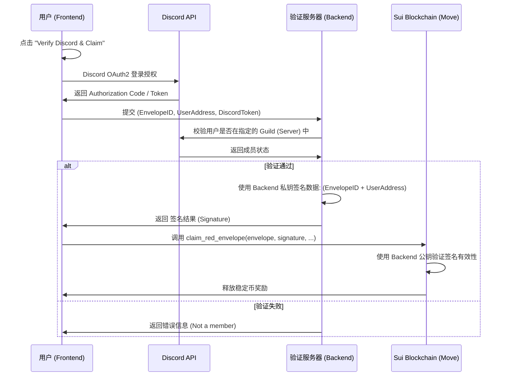

# Discord 验证领取逻辑方案 (Discord Verification Logic)

## 1. 业务流程概览

该方案旨在确保用户只有在加入指定的 Discord 服务器后才能领取特定的红包。

### 16. 时序图

## 2. 模块改动详情

### A. 智能合约 (Move)
- **数据结构**: `RedEnvelope` 增加字段 `requires_verification: bool`。
- **配置**: 存储一个 `trusted_signer_public_key`。
- **函数**: `claim_red_envelope` 增加 `signature: vector<u8>` 参数。
- **校验**: 如果 `requires_verification` 为真，则调用 `sui::ed25519::ed25519_verify` 检查签名。

### B. 后端 (Rust/Axum)
- **私钥管理**: 维护一个离线/环境变量中的私钥用于签署“准考证”。
- **验证接口**: `POST /api/verify-discord`
    - 输入：`envelope_id`, `claimer_address`, `discord_access_token`。
    - 逻辑：通过 Discord API (`/users/@me/guilds`) 检查目标 Guild ID。
    - 输出：Hex 编码的签名字符串。

### C. 前端 (React)
- **创建页**: 增加“开启 Discord 验证”选项。
- **领取页**: 
    - 检查红包元数据。
    - 如果需要验证且未通过，显示 "Verify with Discord" 按钮。
    - 调用 Discord SDK 或 OAuth2 弹窗。
    - 获取签名并提交链上交易。

## 3. 安全性设计
1. **防止重放**: 签名绑定 `UserAddress`，意味着 A 的签名 B 无法使用。
2. **防篡改**: 签名绑定 `EnvelopeID`，意味着针对红包 A 的签名无法用于红包 B。
3. **过期机制**: (可选) 签名中可包含 Timestamp，合约校验是否在有效期内。

---
**下一阶段**: 我将开始修改合约代码以支持签名校验。